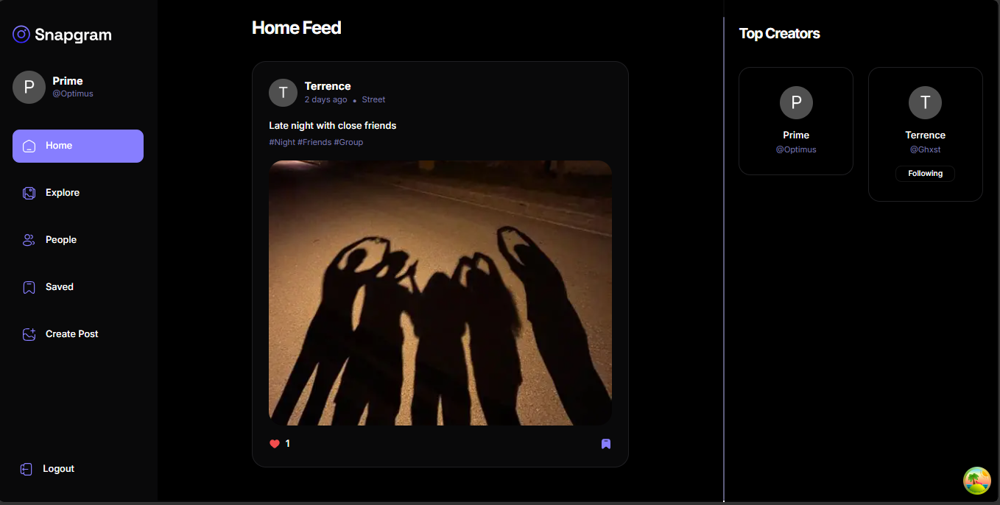

# Ghxst Snap

A full-stack social media app — share photos, follow people, like and save
posts — built with React, TypeScript, and Appwrite.

<!--
  Add a screenshot or two of the running app here. A couple of options:

  1. Drop image files into a folder like `docs/` or `.github/images/` at the
     repo root, then reference them like:
     

  2. Or just drag-and-drop an image into this file on GitHub once it's
     pushed — GitHub will upload it and generate the right markdown for you.
-->


## Features

- Email/password authentication (sign up, sign in, sign out)
- Create, edit, and delete posts with an image, caption, location, and tags
- Like and save posts
- Follow and unfollow other users, with live follower/following counts
- Infinite-scrolling home feed and full-text post search
- User profiles with their own posts and liked posts
- Responsive, dark-themed UI

## Tech stack

- **Frontend:** React 19, TypeScript, Vite, Tailwind CSS, React Router, TanStack Query, React Hook Form + Zod
- **Backend:** [Appwrite](https://appwrite.io) — Auth, Databases, Storage

## Getting started

This app needs an Appwrite backend before it does anything useful — database,
collections, and a storage bucket. Full step-by-step setup (including the
exact schema) lives in **[SETUP.md](./SETUP.md)**.

Short version, once your `.env` is filled in:

```bash
npm install --legacy-peer-deps
npm run dev
```

## Project structure

```
src/
├── _auth/          Sign-in / sign-up pages and forms
├── _root/           Main app pages (home, explore, profile, post details...)
├── components/
│   ├── forms/        Post create/update form
│   ├── shared/        Reusable pieces (post card, nav bars, uploaders...)
│   └── ui/             Base design-system components (button, input, toast...)
├── context/          Auth context/provider
├── lib/
│   ├── appwrite/       All Appwrite SDK calls live here (api.ts, config.ts)
│   ├── react-query/     TanStack Query hooks wrapping the API calls
│   └── validation/      Zod schemas for forms
└── types/            Shared TypeScript types, including Appwrite document shapes
```

## Deployment

See the **Deploying** section in [SETUP.md](./SETUP.md) for the Vercel/Netlify
walkthrough
